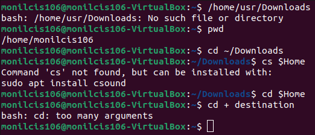
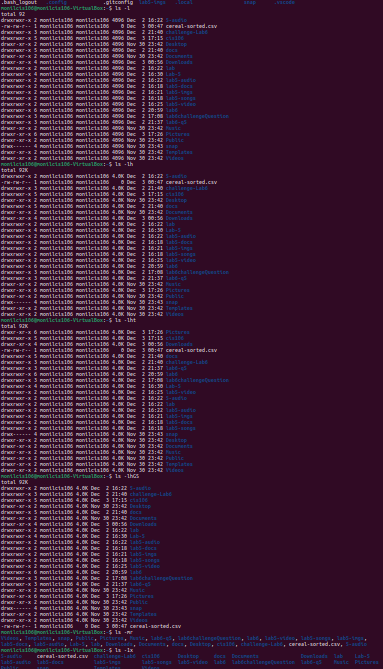

# PRACTICE 1:

# PRACTICE 2:

# PRACTICE CHALLENGE:

## Table Command
| Command          | What it does                              | Syntax                 | Example          |
| ---------------- | ----------------------------------------- | ---------------------- | ---------------- |
| pwd              | Displays the current working directory    | pwd                    | ~pwd             |
| cd               | Changes the working directory             | cd + destination cd    | cd ~,cd home ~   |
| ls               | list the content of current directory     | ls                     | ~ls              |
| ls -a            | list all current working and hidden files | user:ls -a             | ls -a            |
| ls -a ~/pictures | lists all the files ina given directory   | user: ls -a ~/Pictures | ls -a ~/pictures |