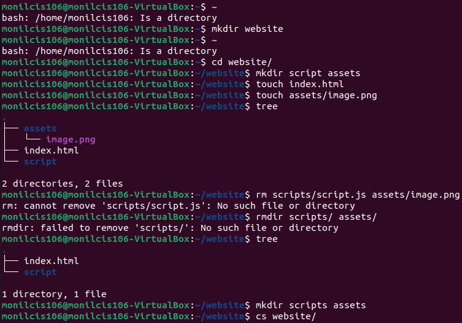
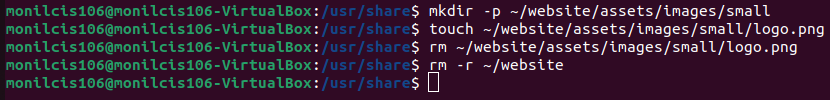
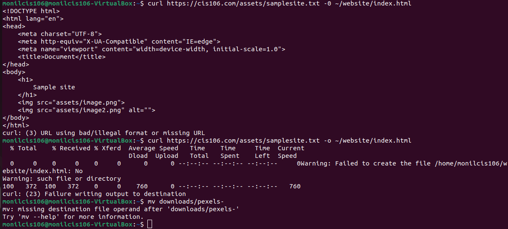
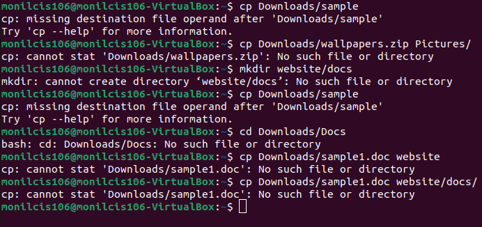

# Monil Chauhan

# CIS106

## Week Report 5

## What are command options?
Command options are Mkdir, CD, CP PWD and RM

## What are command arguments?
command arguments are paramaters that are passed to a script while passing them in the bash shell.

## Which command is ued for creating directories?
Mkdir, mkdir dir1, mkdir dir2, mkdir dir3

## What does the touch command do?
it can be used to create an empty file. touch sheena, touch sheena meena lena, touch -a leena

## How do you remove a file?
rm command removes a file. rm filename, rm website/filename, rm assets/website/filename

## How to remove a directory in linux?
rm -r removes a directory. rmdir -r website/assets

## Explain the mv and cp command?
cp copys files and mv removes files. cp website/downloads, cp website/linus mv website, mv website/downloads

## Practice 1

## Practice 2

## Practice 3

## Practice 4
